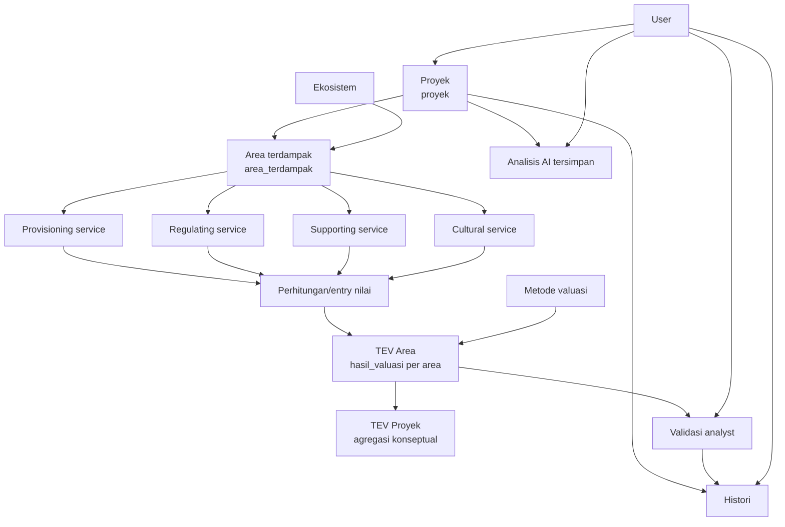

# Workflow bisnis

Workflow berikut memetakan domain yang tersedia di source code. Anak panah dari jasa ekosistem ke perhitungan menunjukkan alur konseptual data; controller saat ini belum menghitung nilai atau TEV otomatis.

1. User membuat proyek dan memilih/merujuk dirinya melalui `id_user`.
2. Area terdampak menghubungkan proyek dengan satu ekosistem dan menyimpan lokasi serta luas.
3. Setiap area dapat memiliki banyak entri provisioning, regulating, supporting, dan cultural service; masing-masing menyimpan `nilai` sendiri.
4. Hasil valuasi menghubungkan area dan metode valuasi serta menyimpan lima komponen nilai dan `tev`.
5. Analyst dicatat sebagai user yang membuat validasi atas hasil valuasi dengan status `Valid`, `Revisi`, atau `Ditolak`, menggunakan metode `Manual` atau `AI`.
6. Histori dapat menyimpan aktivitas user terkait proyek. Analisis AI menyimpan tanya-jawab, sumber, tipe, proyek, dan user.

## Catatan implementasi penting

Tidak ada proses kode yang menjumlahkan empat service menjadi TEV area maupun menjumlahkan TEV area menjadi TEV proyek. Tidak ada tabel kolom khusus TEV proyek. Nilai tersebut perlu dihitung oleh fitur/service baru yang disepakati, atau diambil sebagai agregasi query di lapisan aplikasi; jangan mengklaimnya sebagai perilaku API saat ini.

## Rancangan dari activity diagram TEV (menunggu persetujuan)

Activity diagram yang menjadi acuan menggambarkan alur berikut:

1. Pengguna login, membuat proyek, lalu memasukkan nama, tujuan valuasi, lokasi, tahun, dan deskripsi proyek.
2. Pengguna dapat menambah satu atau lebih area terdampak. Setiap area memiliki nama, jenis ekosistem, luas, dan lokasi/koordinat.
3. Untuk setiap area, pengguna mengisi satu atau lebih entri provisioning, regulating, supporting, dan cultural. Sistem menghitung nilai setiap entri dan total per kategori.
4. Sistem menghitung TEV per area, kemudian menjumlahkan seluruh TEV area untuk memperoleh TEV proyek. Pengguna meninjau hasil dan menyimpan proyek beserta seluruh data pendukungnya.

Rancangan ini **belum dapat diterjemahkan langsung menjadi rumus**. Skema `hasil_valuasi` menyimpan lima komponen TEV (`direct_use_value`, `indirect_use_value`, `option_value`, `existence_value`, dan `bequest_value`), sedangkan diagram hanya mengelompokkan empat jasa ekosistem. Pemetaan dan metode valuasi harus disetujui terlebih dahulu agar tidak terjadi double counting atau pengisian komponen non-use value tanpa dasar data.

### Keputusan yang diperlukan sebelum implementasi

| Topik | Keputusan yang dibutuhkan |
| --- | --- |
| Rumus nilai entri | Rumus resmi untuk regulating dan supporting, serta konfirmasi bahwa provisioning = `produktivitas × harga_pasar × luas_pemanfaatan` dan cultural = `jumlah_pengunjung × biaya_perjalanan × frekuensi`. |
| Pemetaan komponen TEV | Aturan eksplisit untuk memetakan provisioning, regulating, supporting, dan cultural ke DUV, IUV, OV, EV, serta BV. |
| Supporting service | Apakah nilainya dimasukkan ke TEV, dan bila ya, komponen mana yang mencegah double counting dengan jasa lain. |
| Data referensi | Sumber, parameter penyesuaian (misalnya tahun dasar, inflasi, lokasi, luas), serta apakah nilai referensi dapat dioverride pengguna. |
| Siklus hitung | Kapan hasil dihitung ulang: saat draft berubah, hanya saat pengguna menekan aksi hitung, atau saat proyek disimpan. |
| Penyimpanan hasil | Apakah TEV area disimpan sebagai snapshot di `hasil_valuasi`, dan apakah TEV proyek hanya agregasi saat dibaca atau memerlukan kolom/tabel baru. |
| Pembulatan dan validasi | Mata uang, pembulatan per entri/total, penanganan nilai nol, serta aturan untuk nilai negatif atau data belum lengkap. |

Setelah keputusan tersebut tersedia, formula yang disepakati akan didokumentasikan sebagai kontrak bisnis dan diimplementasikan di service aplikasi, bukan di controller atau model event.
