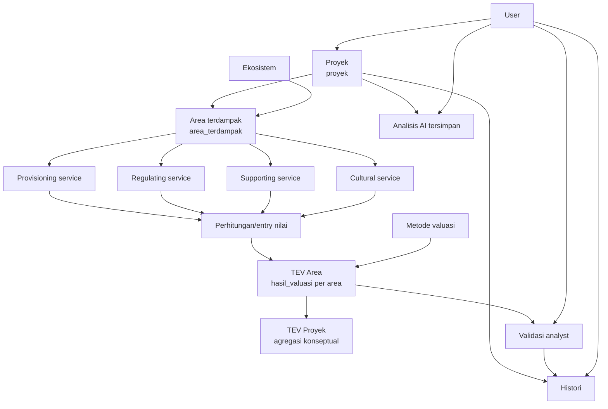

# Workflow bisnis

Workflow berikut memetakan domain yang tersedia di source code. Anak panah dari jasa ekosistem ke perhitungan menunjukkan alur konseptual data; controller saat ini belum menghitung nilai atau TEV otomatis.

1. User membuat proyek dan memilih/merujuk dirinya melalui `id_user`.
2. Area terdampak menghubungkan proyek dengan satu ekosistem dan menyimpan lokasi serta luas.
3. Setiap area dapat memiliki banyak entri provisioning, regulating, supporting, dan cultural service; masing-masing menyimpan `nilai` sendiri.
4. Hasil valuasi menghubungkan area dan metode valuasi serta menyimpan lima komponen nilai dan `tev`.
5. Analyst dicatat sebagai user yang membuat validasi atas hasil valuasi dengan status `Valid`, `Revisi`, atau `Ditolak`, menggunakan metode `Manual` atau `AI`.
6. Histori dapat menyimpan aktivitas user terkait proyek. Analisis AI menyimpan tanya-jawab, sumber, tipe, proyek, dan user.

## Catatan implementasi penting

Tidak ada proses kode yang menjumlahkan empat service menjadi TEV area maupun menjumlahkan TEV area menjadi TEV proyek. Tidak ada tabel kolom khusus TEV proyek. Nilai tersebut perlu dihitung oleh fitur/service baru yang disepakati, atau diambil sebagai agregasi query di lapisan aplikasi; jangan mengklaimnya sebagai perilaku API saat ini.
