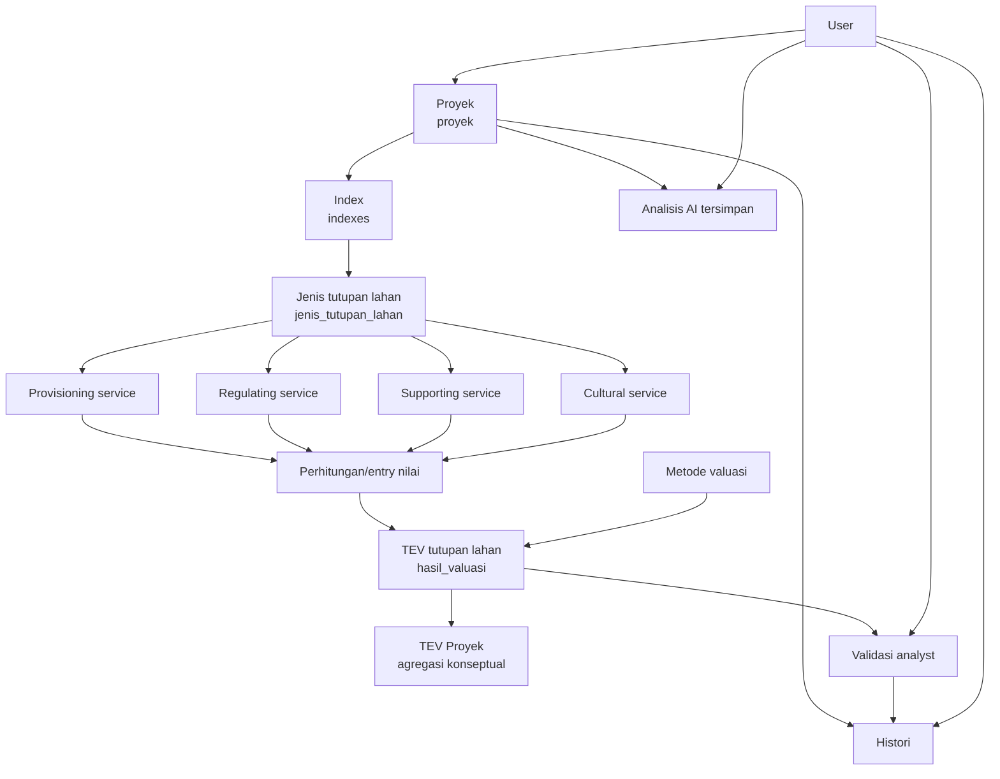

# Workflow bisnis

Workflow berikut memetakan domain yang tersedia di source code. Calculation service menghitung komponen TEV dari service pada tiap jenis tutupan lahan; dashboard menjumlahkannya per index lalu proyek.

1. User membuat proyek dan memilih/merujuk dirinya melalui `id_user`.
2. Proyek menyimpan batas geometri utama dan memiliki banyak index; setiap index memiliki banyak jenis tutupan lahan dengan geometri dan luasnya sendiri.
3. Setiap jenis tutupan lahan dapat memiliki banyak entri provisioning, regulating, supporting, dan cultural service. Nilai provisioning dihitung dari `produktivitas × harga_pasar × luas_pemanfaatan`; nilai cultural dari `jumlah_pengunjung × biaya_perjalanan × frekuensi`; regulating dan supporting memakai `nilai` ekonomi yang direferensikan/diinput.
4. Hasil valuasi menghubungkan jenis tutupan lahan dan metode valuasi serta menyimpan lima komponen nilai dan `tev`.
5. Analyst dicatat sebagai user yang membuat validasi atas hasil valuasi dengan status `Valid`, `Revisi`, atau `Ditolak`, menggunakan metode `Manual` atau `AI`.
6. Histori dapat menyimpan aktivitas user terkait proyek. Analisis AI menyimpan tanya-jawab, sumber, tipe, proyek, dan user.

## Catatan implementasi penting

`TevCalculator` menghitung komponen TEV dari seluruh service pada satu jenis tutupan lahan. `ProjectDashboardService` menjumlahkan nilai tersebut per index dan kemudian per proyek saat endpoint dashboard dibaca; TEV proyek tidak disimpan sebagai kolom snapshot.

## Rancangan dari activity diagram TEV (menunggu persetujuan)

Activity diagram yang menjadi acuan menggambarkan alur berikut:

1. Pengguna login, membuat proyek, lalu memasukkan nama, tujuan valuasi, lokasi, tahun, dan deskripsi proyek.
2. Pengguna menambah satu atau lebih index, lalu jenis tutupan lahan di dalam masing-masing index. Keduanya dapat menyimpan luas dan geometri.
3. Untuk setiap jenis tutupan lahan, pengguna mengisi satu atau lebih entri provisioning, regulating, supporting, dan cultural. Sistem menghitung nilai setiap entri dan total per kategori.
4. Sistem menghitung TEV per jenis tutupan lahan, menjumlahkannya per index, lalu menjumlahkan semua index untuk memperoleh TEV proyek.

Perhitungan TEV mengagregasi nilai semua jasa pada satu jenis tutupan lahan berdasarkan `kategori_tev` (`DUV`, `IUV`, `OV`, `EV`, atau `BV`), lalu menjumlahkan kelima komponen. Kategori dapat ditetapkan per entri jasa. Pemilihan kategorinya tetap harus ditinjau analyst agar tidak terjadi double counting atau pengisian komponen non-use value tanpa dasar data.

### Keputusan yang diperlukan sebelum implementasi

| Topik | Keputusan yang dibutuhkan |
| --- | --- |
| Rumus nilai entri | Rumus resmi untuk regulating dan supporting, serta konfirmasi bahwa provisioning = `produktivitas × harga_pasar × luas_pemanfaatan` dan cultural = `jumlah_pengunjung × biaya_perjalanan × frekuensi`. |
| Pemetaan komponen TEV | Aturan eksplisit untuk memetakan provisioning, regulating, supporting, dan cultural ke DUV, IUV, OV, EV, serta BV. |
| Supporting service | Apakah nilainya dimasukkan ke TEV, dan bila ya, komponen mana yang mencegah double counting dengan jasa lain. |
| Data referensi | Sumber, parameter penyesuaian (misalnya tahun dasar, inflasi, lokasi, luas), serta apakah nilai referensi dapat dioverride pengguna. |
| Siklus hitung | Kapan hasil dihitung ulang: saat draft berubah, hanya saat pengguna menekan aksi hitung, atau saat proyek disimpan. |
| Penyimpanan hasil | Apakah TEV jenis tutupan lahan disimpan sebagai snapshot di `hasil_valuasi`, dan apakah TEV proyek hanya agregasi saat dibaca atau memerlukan kolom/tabel baru. |
| Pembulatan dan validasi | Mata uang, pembulatan per entri/total, penanganan nilai nol, serta aturan untuk nilai negatif atau data belum lengkap. |

Setelah keputusan tersebut tersedia, formula yang disepakati akan didokumentasikan sebagai kontrak bisnis dan diimplementasikan di service aplikasi, bukan di controller atau model event.
